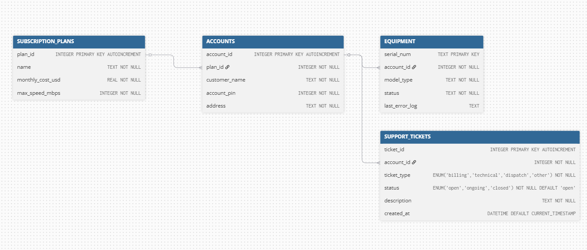

# Nexlink-Telecom-A-Technical Support

## The Company & The Problem

**Nextlink** is an Internet Service Provider (ISP) dealing with a high volume of customer support requests. Human agents are currently overwhelmed by routine tasks: diagnosing router LED codes, upgrading/downgrading customer billing tiers, and dispatching field technicians for physical line repairs. 

The core technical problem is bridging the gap between messy, unpredictable inputs and high-stakes database executions:
* **Messy Inputs:** Customers describe hardware failures in non-technical terms ("the dog chewed the white wire"), and routers output unstructured, noisy error logs. Standard deterministic scripts crash trying to parse this data.
* **High-Stakes Actions:** Standard, unconstrained LLMs are too dangerous to trust with billing databases. If an AI hallucinates a  "Free Internet" plan or accidentally dispatches a technical support onsite (just because the router needed a restart), the financial damage is immediate and the support quality suffers.

## The Solution

We built an **MCP (Model Context Protocol) Server** to act as a secure, intelligent bridge. 
### Note: to be written once we have figured out all the features.

## Database Architecture

To execute provisioning and diagnostics, the MCP server connects to a local relational database (SQLite). The schema enforces strict data integrity using `AUTOINCREMENT` integer primary keys, explicit foreign key relations, and strict `CHECK` constraints to emulate Enums for equipment statuses and ticketing.

The database is built and populated using `db/setup_db.py`, which executes:
1. **`schema.sql`**: Defines the strict table boundaries.
2. **`seed.sql`**: Injects varied test scenarios, including active users, users with raw hardware failure syslogs, and open support tickets.

### Entity-Relationship Diagram (ERD)

Everything branches securely off the central `ACCOUNTS` table, ensuring the agent cannot query equipment or manipulate billing without a valid account context.

